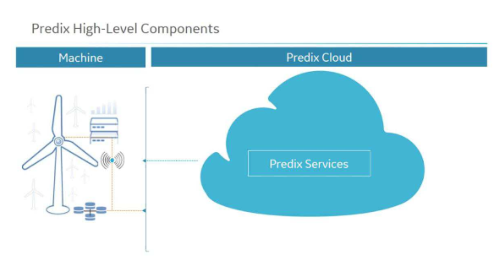
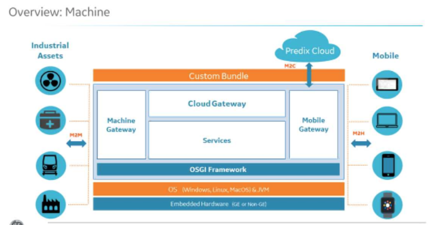
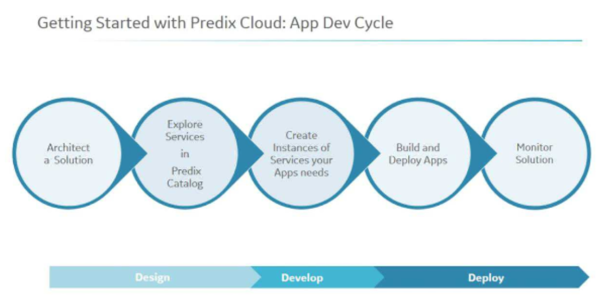

# Predix 101

---

# What is Predix?

Predix is software optimized for building and running industrial internet applications.

Predix is a Platform-as-a-Service (PaaS) that helps companies:

* Capture and analyze large amounts of industrial data
* Create a system-wide view of assets
* Quickly develop and deploy industrial apps
* Leverate and ecosystem of services built and maintained be GE and partners

---

# What types of applications run on Predix?

* Monitoring of industrial equipment
* Predictive analysis
* Economic optimizations of assets
* Process automation

---

# Application qualities

* Ingest machine and sensor generated data
* Provide insights using analytics
* Manage information access
* \* Not intended for real-time (sub-second) systems
* Use a microservices architecture
* Follow guidelines for [12 Factor App](https://12factor.net/)

---

# Predix Primary Components

* Predix Machine
* Predix Cloud
* Predix Services

---

---

# Predix Machine

* Device-independent software used to gather data and push it to the cloud
* Installed on gateways, industrial controllers, and sensors
* Responsible for communicating with the industrial asset and Predix cloud
* Can run local applications, such as edge analytics
* Uses OSGi framework
* Java only
* Hardware agnostic, runs on anything that supports Linux or Windows
* Communicates to cloud over web sockets

---

# Predix Machine Architecture

---

# Machine Gateway

* Provides M2M services to communicate between gateways and/or sensors
* Communication protocols
  * OPC-UA
  * Modbus
  * MQTT
* store and forward for intermittent connectivity

---

# Cloud / Mobile Gateway

* Communication to Predix cloud
* WebSocket Server service
* REST APIs

---

# Predix Cloud

* Global, secure cloud infrastructure
* Meets regulartory standards (healthcare, aviation, etc.)
* Deploy scalable solutions
* Built on Cloud Foundry (open source PaaS)

---

---

# Orgs and Spaces

* org is an development account
* org includes 1 or more spaces
* spaces provide access to a shared location
* Ex: DevSpace, ProdSpace, TestSpace

---

# Predix Services

* Provides a service marketplace (Heroku addons)
* [Catalog of Services](https://www.predix.io/catalog/services)

---

# Security Services

### UAA - User Account & Authentication Service

* authorize apps to act on behalf of users
* authenticate users
* can integrate with 3rd-party identity providers for SSO

### ACS - Access Control Services

* fine-grained authorization
* attribute management
* policy management
* policy evaluation

---

# Data Management Services

* Asset Service - Store/retrive asset properties (Cassandra)
* Time Series Store - manage, ingest, store, analyze
* Blobstore - large byte arrays (S3)
* Database as a service - PostgreSQL
* Key-value Store - Redis
* Message Queue (AMQP) - RabbitMQ

---

