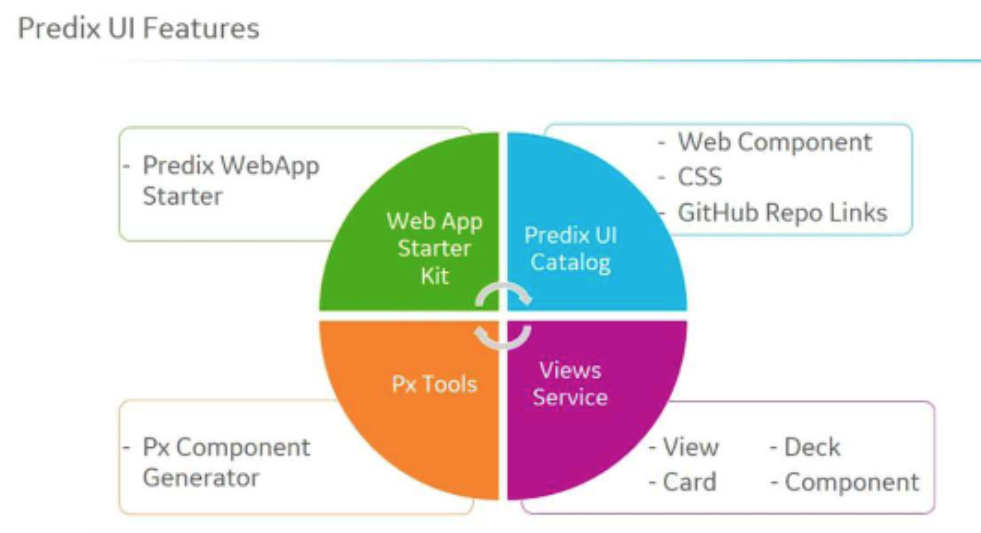

# Predix 101

---

# What is Predix?

Predix is software optimized for building and running industrial internet applications.

Predix is a Platform-as-a-Service (PaaS) that helps companies:
* Capture and analyze large amounts of industrial data
* Create a system-wide view of assets
* Quickly develop and deploy industrial apps
* Leverage services built and maintained by GE and partners

---

# What types of applications run on Predix?

* Monitoring of industrial equipment
* Predictive analysis
* Economic optimizations of assets
* Process automation

---

# Application qualities

* Ingest machine and sensor generated data
* Provide insights using analytics
* Manage information access
* \* Not intended for real-time (sub-second) systems
* Use a microservices architecture
* Follow guidelines for [12 Factor App](https://12factor.net/)

---

# Predix Primary Components

* Predix Machine
* Predix Cloud
* Predix Services

---

---

# Predix Machine

* Gather data and push it to the cloud
* Runs on gateways, industrial controllers, and sensors
* Responsible for communicating with the asset and Predix cloud
* Can run local applications, such as edge analytics
* Uses OSGi framework (Java only)
* Hardware agnostic, runs on anything that supports Linux or Windows
* Communicates to cloud over web sockets

---

# Predix Machine Architecture

---

# Machine Gateway

* Provides M2M services to communicate between gateways and/or sensors
* Communication protocols
  * OPC-UA
  * Modbus
  * MQTT
* store and forward for intermittent connectivity

---

# Cloud / Mobile Gateway

* Communication to Predix cloud
* WebSocket Server service
* REST APIs

---

# Predix Cloud

* Global, secure cloud infrastructure
* Meets regulartory standards (healthcare, aviation, etc.)
* Deploy scalable solutions
* Built on Cloud Foundry (open source PaaS)

---

---

# Orgs and Spaces

* org is an development account
* org includes 1 or more spaces
* spaces provide access to a shared location
* Ex: DevSpace, ProdSpace, TestSpace

---

# Predix Services

* Provides a service marketplace (Heroku addons)
* [Catalog of Services](https://www.predix.io/catalog/services)

---

# Security Services

* UAA - User Account & Authentication Service
* ACS - Access Control Services

---

### UAA - User Account & Authentication Service

* authorize apps to act on behalf of users
* authenticate users
* can integrate with 3rd-party identity providers for SSO

---

### ACS - Access Control Services

* fine-grained authorization
* attribute management
* policy management
* policy evaluation

---

# Data Management Services

* Asset Service - Store/retrive asset properties (Cassandra)
* Time Series Store - manage, ingest, store, analyze
* Blobstore - large byte arrays (S3)
* Database as a service - PostgreSQL
* Key-value Store - Redis
* Message Queue (AMQP) - RabbitMQ

---

# Asset Data Service

* REST APIs for asset modeling
* CRUD operations on asset model data
* Define asset properties as well as relationships
* Quickly retrieve large amounts of asset data

---

# Time Series

* sequence of data points collected at set time intervals
* quick ingest, store, and analyze time series data
* indexing for quick retrieval
* millisecond data point precision
* horizontal scalability
* High availability access & query via HTTP

---

# Blobstore

* Securely store large byte arrays
* Store large amounts of persistent data (images, video, etc)
* S3 API compatible / SDK
* Scalable, reliable, high availability
* Blobs can be accessed by the app in a file-like stream
* Retrieve any file type

---

# Database as a Service

* PostgreSQL
* backups
* Point In Time Recovery (PITR)
* Encryption at rest

---

# Redis - Key-Value Store

* Fast, in-memory key value datastore
* Non-relational, open-source, and horizontally scalable
* Supports most datatypes, data replication, and save data on disk
* Used mainly in caching and message-queues

---

# RabbitMQ

* Persistent, reliable messaging between applications, components & devices
* Multi language support (Java, Ruby, Python, etc)
* Exchanges supported:
  * Built-in direct
  * Fanout
  * Topic
  * Header exchange types

---

### Analytics Framework

* Validate and perform test executions of the analytic
* Specify a taxonomy
* Integrate analytics in the cloud with your custom app
* Support elastic execution using the Job Scheduler
* Create/Manage rules around an orchestration or individual analytic
* Retrieve a history of scheduled executions
* [Analytics Catalog](https://www.predix.io/catalog/analytics)

---

# Predix UI

---

# Predix WebApp Starter

Polymer based web application starter kit aimed at accelerating Predix UI application development.

[WebApp Starter](https://github.com/predixdev/predix-webapp-starter)

* Front end components built on Polymer
* Back end is NodeJS/Express

---

# Predix UI Catalog

UI components to quickly create web applications.

* https://predix-ui.com
* CSS - Sass modules (Include buttons, colors, layout, and typography)
* 40+ web components for UI/UX development
* GitHUb repos for each component

---

# Px Tools

The Px Component Generator is a starting point for building custom UI components

---

# Views Service

Views service stores all the visual information available in a web application,
such as the state and layout of card and deck objects or relationship information
between card and deck objects.

---

# Reference App

The RMD app monitors machine operations, reports irregularities and analyzes patterns of behavior and performance over time

---

# Services Used

* Asset
* Analytics
* Time Series
* UAA
* Predix Machine
* Data ingestion

---

# Components Used

* Contextual Dashboard
* Data grid
* Time-series

---

# RMD Reference App

[RMD](https://rmd-ref-app.run.aws-usw02-pr.ice.predix.io/#/rmd)
